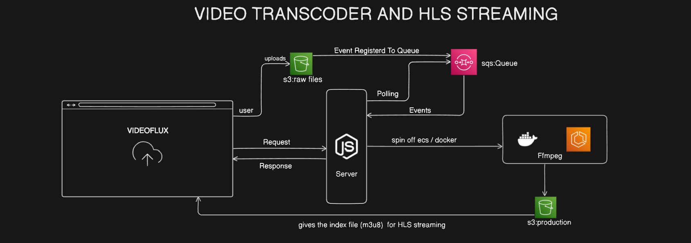
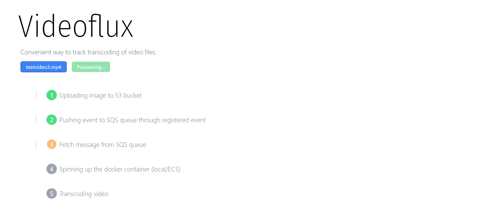
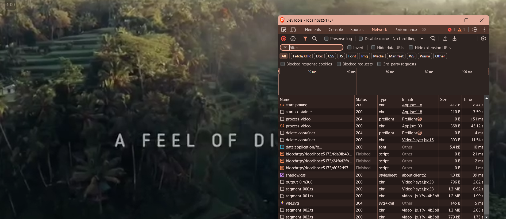

# VideoFlux

VideoFlux is a transcoding application that enables adaptive bitrate streaming using HLS (HTTP Live Streaming). The application allows users to upload video files to an S3 bucket via pre-signed URLs, processes them using FFmpeg for HLS transcoding, and serves the output for playback using Video.js.

## Features

- **Video Upload**: Users can upload videos using a pre-signed URL to a specified S3 bucket.
- **Event-Driven Processing**: Uploading a video triggers an event, sending a message to Amazon SQS (Simple Queue Service).
- **Flexible Transcoding Options**: The Node.js server can either poll the SQS queue to detect newly added S3 objects or manually trigger an ECS machine remotely to run the transcoding. Containers can also be spun up locally.
- **FFmpeg-based Transcoding**: Uses FFmpeg for converting the uploaded video file into multiple HLS-compatible formats.
- **HLS Streaming**: The transcoded HLS files are uploaded to a new S3 bucket for streaming.
- **Video.js Integration**: The transcoded HLS streams can be played back using Video.js.

## Architecture



1. The user uploads a video file using a pre-signed URL generated for an S3 bucket.
2. Upon successful upload, an event triggers a message to be pushed to Amazon SQS.
3. A Node.js server polls the SQS queue to detect new videos or manually triggers an ECS task/container to process the video.
4. The video is transcoded using FFmpeg to create HLS-compatible streams.
5. Transcoded files are uploaded to a new S3 bucket.
6. The HLS streams are rendered in the frontend using Video.js for playback.

## Demo

Here are some screenshots showing the various stages of the application:

### 1. Tracking Page



### 2. Video Streaming with segment coming



## Requirements

- **Node.js**: Backend server for processing events and managing video transcoding.
- **FFmpeg**: For converting the uploaded video into HLS segments.
- **AWS Services**: S3, SQS, ECS for cloud storage, messaging, and container orchestration.
- **Docker (Optional)**: For local development and testing with containers.
- **Video.js**: For rendering HLS streams in the web frontend.

## Getting Started

1. Clone the repository:
   ```bash
   git clone <REPOSITORY_URL>
   cd backend/
   node index.js
   cd ..
   cd frontend/
   npm run dev
   ```
2. Setup .env files
   ```bash
   AWS_IAM_KEY =tanmay
   AWS_IAM_SECRET_ACCESS_KEY = key
   QUEUE_URL = queue_url


   ```
